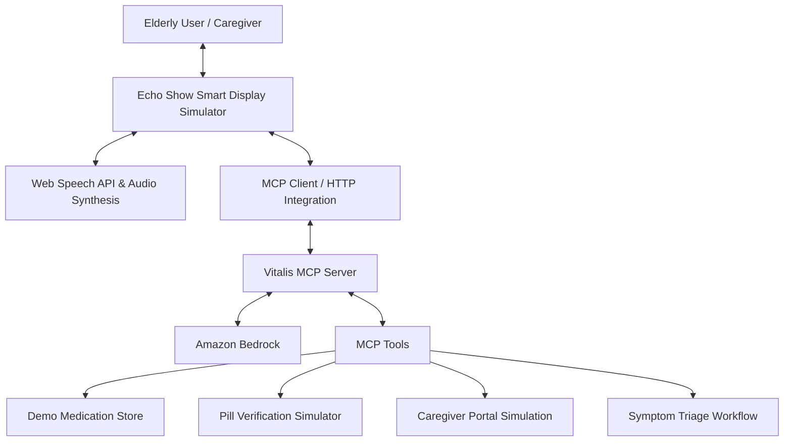

# Vitalis AI — AI Eldercare & Health Advocate on Alexa+

[](https://opensource.org/licenses/MIT)
[](https://modelcontextprotocol.io)
[]()
[](https://aws.amazon.com/bedrock/)
[]()

> **Built for the Amazon Developer Hackathon: Build, Ship, Shape (2026)**  
> **Primary Track:** Alexa+  
> **Mini-Challenges:** AWS Builder & Open Source

---

## 🌟 Executive Summary

**Vitalis AI** is an Alexa+ healthcare-assistant concept built around a self-hosted **Model Context Protocol (MCP)** server and an Echo Show-style web simulator.

The project demonstrates how an AI assistant can coordinate medication routines, medication verification, health-symptom triage, vital summaries, and caregiver alerts through standardized MCP tools. It combines deterministic safety-oriented workflows with **Amazon Bedrock** for conversational responses.

The project is designed as a hackathon prototype and simulation. It uses a demo patient profile and simulated caregiver-portal and pill-verification workflows rather than connecting to real clinical systems or external emergency-notification services.

### Key Capabilities

- 🗣️ **Voice-Style Health Conversations**: The Echo Show simulator provides an interactive interface for medication routines, health questions, and caregiver workflows.
- 💊 **Medication Management**: Checks medication schedules, records taken/skipped/delayed doses, and maintains demo adherence information.
- 📷 **Pill Verification Simulation**: Demonstrates medication identity, dosage, prescription matching, expiration, and allergy-safety checks using predefined test scenarios.
- ⚡ **MCP Streamable HTTP Server**: Self-hosted MCP server using the official MCP SDK and Streamable HTTP transport, implementing MCP specification `2025-11-25`.
- 🩺 **Symptom Triage Workflow**: Detects configured emergency red flags, assigns severity, records caregiver alerts, and uses Amazon Bedrock to generate an empathetic response.
- 🛡️ **Caregiver Portal Simulation**: Records alerts with urgency, event details, and suggested caregiver actions.
- 💻 **MCP Developer Telemetry**: Provides a dashboard-oriented SSE stream for observing MCP activity and tool execution.

---

## 🏛️ System Architecture



## MCP Transport

Vitalis AI exposes MCP through Streamable HTTP at:

```text
POST /mcp
GET  /mcp
DELETE /mcp
```

The implementation uses the official MCP TypeScript SDK with stateful MCP sessions identified through the `mcp-session-id` header.

A separate `/sse` endpoint provides dashboard telemetry. It is **not** the MCP transport endpoint.

---

## 🛠️ Registered Model Context Protocol (MCP) Tools

Vitalis AI exposes 6 MCP tools through the MCP `2025-11-25` Streamable HTTP implementation:

| Tool Name | Description |
| :--- | :--- |
| `check_medication_schedule` | Retrieves the demo patient's scheduled medications, adherence information, and pending doses. |
| `log_medication_dose` | Records a medication as taken, skipped, or delayed and updates the demo medication state appropriately. |
| `verify_pill_bottle_vision` | Simulates pill-bottle verification using predefined scenarios for medication identity, dosage, prescription matching, expiration, and allergy safety. |
| `evaluate_health_symptoms` | Runs the symptom triage workflow, detects configured emergency red flags, records alerts, and generates an empathetic Bedrock response. |
| `dispatch_caregiver_alert` | Records a caregiver alert in the simulated caregiver portal with an urgency level and suggested action. |
| `get_daily_vital_summary` | Returns the demo patient's latest vital information, including blood pressure, heart rate, blood glucose, hydration, and sleep. |

---

## 🚀 Quick Start Guide

### Prerequisites

- Node.js v18+
- npm v9+

### 1. Clone & Install

```bash
git clone https://github.com/Yemmmyc/vitalis-ai.git
cd vitalis-ai
npm install
npm install --prefix client
```

### 2. Configure Environment

Copy the example environment file:

```bash
cp .env.example .env
```

The project can run its demo workflows locally without requiring live AWS credentials for every feature.

If you choose to enable the Amazon Bedrock integration, configure AWS credentials using your normal AWS credential mechanism. **Do not commit credentials or secret keys to `.env` or GitHub.**

### 3. Build and Test

```bash
npm run server:build
npm test
```

The automated test suite validates MCP initialization, tool discovery, tool execution, medication-state behavior, and time-of-day medication filtering.

### 4. Build the Full Stack

```bash
npm run build
```

### 5. Start the Server

```bash
npm run server:start
```

Open:

```text
http://localhost:4000
```

Useful endpoints:

```text
Health:              http://localhost:4000/health
MCP Streamable HTTP: http://localhost:4000/mcp
Dashboard telemetry: http://localhost:4000/sse
```

For hot-reloading development:

```bash
npm run dev
```

The Vite client runs on port `3000` while the MCP server runs on port `4000`.

---

## 📁 Repository Structure

```text
Buld_Ship_Shape/
├── client/                     # Echo Show Smart Display React frontend
│   ├── src/
│   │   ├── components/         # Display and healthcare workflow components
│   │   ├── App.tsx             # Main smart-display interface
│   │   └── types.ts            # Frontend TypeScript types
│   ├── package.json
│   └── vite.config.ts
├── server/                     # Vitalis MCP Server
│   ├── src/
│   │   ├── tools/              # Medication, vision, triage, caregiver tools
│   │   ├── data/               # Demo patient data store
│   │   ├── bedrock-service.ts  # Amazon Bedrock integration
│   │   ├── mcp-server.ts       # MCP tool registration and compatibility layer
│   │   └── index.ts            # Express + MCP Streamable HTTP server
│   ├── package.json
│   └── tsconfig.json
├── tests/                      # Automated MCP and tool tests
│   └── mcp-server.test.mjs
├── docs/                       # Hackathon documentation
│   ├── SUBMISSION_DETAILS.md
│   ├── PRODUCT_FEEDBACK.md
│   ├── FRICTION_LOG.md
│   └── VIDEO_SCRIPT_3MIN.md
├── LICENSE                     # MIT Open Source License
└── package.json                # Root orchestration and scripts
```

---

## 🏆 Hackathon Tracks & Challenges

- **Primary Track — Alexa+**: Self-hosted MCP server using Streamable HTTP and MCP specification `2025-11-25`, demonstrated through an Echo Show-style web simulator.
- **Mini-Challenge — AWS Builder**: Integrates Amazon Bedrock into the healthcare-assistant workflow for AI-generated conversational responses.
- **Mini-Challenge — Open Source**: Released as an MIT-licensed public GitHub project.
- **Bonus — Friction Logs**: Development experience and integration challenges are documented in `docs/FRICTION_LOG.md`.

---

## ⚠️ Prototype & Safety Notice

Vitalis AI is a **hackathon prototype and demonstration**, not a medical device or clinical decision-support system.

The project uses a demo patient profile and simulated healthcare workflows. It does not replace professional medical advice, emergency services, clinical systems, or real caregiver notification infrastructure.

---

## 📜 License

Distributed under the **MIT License**. See `LICENSE` for more information.
