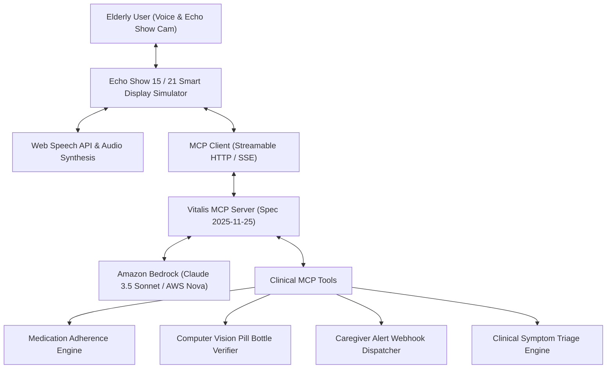

# Vitalis AI — Autonomous Multimodal Ambient Eldercare & Health Advocate on Alexa+

[](https://opensource.org/licenses/MIT)
[](https://modelcontextprotocol.io)
[]()
[](https://aws.amazon.com/bedrock/)
[]()

> **Built for the Amazon Developer Hackathon: Build, Ship, Shape (2026)**  
> **Primary Track:** Alexa+  
> **Mini-Challenges:** AWS Builder & Open Source  

---

## 🌟 Executive Summary

Over 54 million seniors in the United States alone live independently or with chronic conditions. While smart speakers like Amazon Echo are already present in hundreds of millions of homes, they remain fundamentally **reactive**—answering timers and playing music, but helpless when an elderly parent forgets critical medication, suffers subtle cognitive confusion, or experiences emergency chest pain.

**Vitalis AI** is the next leap forward for **Alexa+**. Built on the open **Model Context Protocol (MCP)** specification (v2025-11-25) using **Streamable HTTP transport** and powered by **Amazon Bedrock**, Vitalis transforms Echo smart displays into autonomous, proactive clinical advocates.

### Key Capabilities
- 🗣️ **Empathetic Proactive Voice Dialogue**: Engages in natural conversations, checking in on morning routines, hydration, and vocal distress.
- 📷 **Echo Show Multimodal Pill Bottle Scanner**: Uses Amazon Bedrock Computer Vision to verify drug labels, matching dosages against prescriptions and detecting lethal allergy conflicts (e.g. Penicillin) before ingestion.
- ⚡ **Streamable HTTP Model Context Protocol (MCP)**: Self-hosted MCP server providing standardized clinical tools for schedule adherence, dose logging, biometric telemetry, and caregiver escalation.
- 🛡️ **Autonomous Caregiver Emergency Circle**: Real-time push alerts and SMS escalation to family members (e.g., David Vance) with suggested interventions.
- 💻 **Live MCP Developer Inspector**: Real-time visualization of JSON-RPC 2.0 tool requests, latency tracking, and Bedrock model telemetry.

---

## 🏛️ System Architecture



---

## 🛠️ Registered Model Context Protocol (MCP) Tools

Vitalis AI exposes 6 production-grade tools following the **MCP 2025-11-25 Streamable HTTP specification**:

| Tool Name | Transport | Description |
| :--- | :--- | :--- |
| `check_medication_schedule` | Streamable HTTP | Retrieves daily prescription times, active medications, and current adherence streak. |
| `log_medication_dose` | Streamable HTTP | Logs that a dose was taken or delayed, updating compliance streaks and notifying caregivers. |
| `verify_pill_bottle_vision` | Streamable HTTP | Multimodal Bedrock vision OCR verifying bottle label, expiration, patient name, and allergy cross-checks. |
| `evaluate_health_symptoms` | Streamable HTTP | Evaluates reported symptoms, detects stroke FAST criteria or cardiac red flags, and initiates emergency protocols. |
| `dispatch_caregiver_alert` | Streamable HTTP | Dispatches real-time alerts to family/nurse channels with urgency levels (`INFO`, `WARNING`, `URGENT`, `EMERGENCY`). |
| `get_daily_vital_summary` | Streamable HTTP | Biometric telemetry: blood pressure, glucose, sleep, hydration. |

---

## 🚀 Quick Start Guide

### Prerequisites
- Node.js v18+ (tested on Node v20/v24)
- npm v9+

### 1. Clone & Install
```bash
git clone https://github.com/your-username/vitalis-ai.git
cd vitalis-ai
npm install
npm install --prefix client
```

### 2. Configure Environment (Optional)
Copy `.env.example` to `.env`:
```bash
cp .env.example .env
```
*(Note: Vitalis AI includes a built-in intelligent Bedrock emulation layer, so you can test all features immediately without entering AWS credentials! To connect to live AWS Bedrock, simply provide your `AWS_ACCESS_KEY_ID` and `AWS_SECRET_ACCESS_KEY` in `.env`)*.

### 3. Run Automated Tests
```bash
npm run server:build
npm test
```
All 8 test suites will execute and validate protocol handshakes, schema definitions, and tool executions.

### 4. Launch Full Stack (Server + Echo Show Simulator)
```bash
npm run build
npm run server:start
```
Open your browser at **`http://localhost:4000`** to experience the full Echo Show Smart Display interface!

*(For hot-reloading development mode, run `npm run dev` to launch Vite on port 3000 and the MCP server on port 4000).*

---

## 📁 Repository Structure

```
Buld_Ship_Shape/
├── client/                     # Echo Show Smart Display React/Tailwind frontend
│   ├── src/
│   │   ├── components/         # Header, VoiceAssistant, MedicationWidget, PillScannerModal, etc.
│   │   ├── App.tsx             # Main Echo Show smart display layout
│   │   └── types.ts            # Frontend TypeScript types
│   ├── package.json
│   └── vite.config.ts
├── server/                     # Alexa+ MCP Server (Streamable HTTP)
│   ├── src/
│   │   ├── tools/              # MCP Tools (medication, vision, triage, caregiver)
│   │   ├── data/               # Patient electronic health record store
│   │   ├── bedrock-service.ts  # Amazon Bedrock Claude 3.5 / Nova integration
│   │   ├── mcp-server.ts       # Model Context Protocol JSON-RPC 2.0 implementation
│   │   └── index.ts            # Express + SSE Streamable HTTP server
│   ├── package.json
│   └── tsconfig.json
├── tests/                      # Automated MCP protocol & tool test suites
│   └── mcp-server.test.mjs
├── docs/                       # Hackathon deliverables
│   ├── SUBMISSION_DETAILS.md   # Complete Devpost text & details
│   ├── PRODUCT_FEEDBACK.md     # Amazon Developer tools feedback
│   ├── FRICTION_LOG.md         # 10% bonus friction logs
│   └── VIDEO_SCRIPT_3MIN.md    # 3-minute video presentation script
├── LICENSE                     # MIT Open Source License
└── package.json                # Root orchestration & scripts
```

---

## 🏆 Hackathon Tracks & Challenges

- **Primary Track**: Alexa+ (Self-hosted MCP Server, Streamable HTTP 2025-11-25 spec, Simulated Web App).
- **Mini-Challenge 1**: AWS Builder (Amazon Bedrock multi-modal vision and clinical reasoning).
- **Mini-Challenge 2**: Open Source (Full MIT open source release).
- **Bonus**: 10% Judging Bonus via detailed Friction Logs in `docs/FRICTION_LOG.md`.

---

## 📜 License
Distributed under the **MIT License**. See `LICENSE` for more information.
