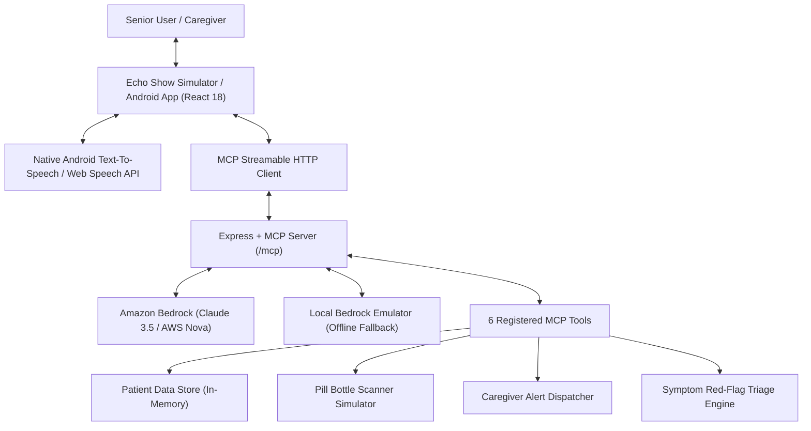

# Vitalis AI — Autonomous AI Eldercare & Health Advocate on Alexa+

[](https://opensource.org/licenses/MIT)
[](https://modelcontextprotocol.io)
[]()
[](https://aws.amazon.com/bedrock/)
[](https://capacitorjs.com/)
[]()

> **Built for the Amazon Developer Hackathon: Build, Ship, Shape (2026)**  
> **Primary Track:** Alexa+  
> **Mini-Challenges:** AWS Builder & Open Source  
> **Submission Release:** [QAF 2.0 Product Submission v1.0.0](https://github.com/Yemmmyc/vitalis-ai/releases/tag/v1.0.0)

---

## 🌟 Executive Summary & Problem Statement

### Problem Statement
Caring for aging family members presents persistent challenges: maintaining complex medication routines, verifying prescription accuracy, recognizing early signs of health deterioration, and keeping family caregivers informed without compromising the senior's independence. Traditional voice assistants are reactive and lack context-aware tool coordination, while standard health apps can be difficult for seniors to navigate.

### Product Purpose
**Vitalis AI** is an autonomous eldercare assistant and health advocate designed for **Alexa+** smart displays (Echo Show) and mobile devices. Built on the **Model Context Protocol (MCP)** specification `2025-11-25` and powered by **Amazon Bedrock**, Vitalis AI bridges natural voice interaction with structured, safety-first healthcare tools.

It provides a proactive interface for routine medication tracking, visual pill-bottle verification, symptom triage with emergency red-flag detection, daily vital summaries, and caregiver alert dispatching.

---

## 🎯 Main Features & Intended Users

### Intended Users
- **Seniors & Older Adults**: Seeking an accessible, voice-enabled assistant for daily medication reminders, symptom reporting, and visual pill verification.
- **Family Caregivers & Adult Children**: Wanting peace of mind through real-time caregiver alerts, adherence streaks, and daily vital summaries.
- **Healthcare Coordinators & Developers**: Exploring standardized MCP tool integration between LLMs and healthcare data pipelines.

### Core Capabilities
- 🗣️ **Voice & Smart Display Interface**: Multi-modal Echo Show simulator interface featuring interactive voice interaction with native Android Text-To-Speech.
- 💊 **Medication Routine Management**: Time-of-day filtering (morning, afternoon, evening, bedtime), dose logging (`taken`, `skipped`, `delayed`), and adherence streak calculation.
- 📷 **Pill Bottle Verification Simulation**: Predefined visual verification checking drug identity, dosage, prescription matching, expiration dates, and allergy red flags (e.g. Penicillin allergy warnings).
- 🩺 **Symptom Triage & Red-Flag Detection**: Analyzes symptom reports in natural language, identifies emergency indicators (e.g. chest pain, dyspnea), assigns severity (`EMERGENCY`, `URGENT`, `ROUTINE`), and dispatches caregiver alerts.
- ⚡ **Self-Hosted MCP Streamable HTTP Server**: Full implementation of MCP Spec `2025-11-25` using `@modelcontextprotocol/sdk` and Streamable HTTP transport (`/mcp`).
- 🤖 **Amazon Bedrock Integration & Local Fallback**: Integrates Amazon Bedrock (Claude 3.5 Sonnet / AWS Nova) for empathetic clinical responses, with a zero-config local emulation mode when offline or credentials are omitted.
- 📱 **Native Capacitor 8 Android Application**: Mobile wrapper built for Android devices, equipped with `@capacitor-community/text-to-speech` for native audio playback, responsive screen-fit layout, and verified microphone permissions (`RECORD_AUDIO`).

---

## 🏛️ Technology Stack & Architecture

### Tech Stack Overview

| Layer | Technologies |
| :--- | :--- |
| **Frontend / Web Simulator** | React 18, Vite 6, TypeScript, Tailwind CSS, Lucide React Icons |
| **Mobile Application** | Capacitor 8 (`@capacitor/core`, `@capacitor/android`), OpenJDK 21, Gradle |
| **Audio & Voice** | `@capacitor-community/text-to-speech` (Native Android TTS), Web Speech API |
| **MCP Server / Backend** | Node.js, Express, TypeScript, `@modelcontextprotocol/sdk` (v1.0.4) |
| **MCP Spec & Transport** | Spec `2025-11-25`, Streamable HTTP (`POST/GET/DELETE /mcp`), SSE Telemetry (`/sse`) |
| **AI / LLM Integration** | `@aws-sdk/client-bedrock-runtime` (Amazon Bedrock) + Local Emulation Fallback |
| **Testing & Build** | Node Test Runner (`node:test`), Vitest/Vite, Android Gradle (`assembleDebug`) |

### Architectural Flow


```mermaid
graph TD
    User["Senior User / Caregiver"] <--> UI["Echo Show Simulator / Android App (React 18)"]
    UI <--> TTS["Native Android Text-To-Speech / Web Speech API"]
    UI <--> MCPClient["MCP Streamable HTTP Client"]
    MCPClient <--> ExpressServer["Express + MCP Server (/mcp)"]
    ExpressServer <--> Bedrock["Amazon Bedrock (Claude 3.5 / AWS Nova)"]
    ExpressServer <--> BedrockFallback["Local Bedrock Emulator (Offline Fallback)"]
    ExpressServer <--> MCPTools["6 Registered MCP Tools"]
    MCPTools --> MedStore["Patient Data Store (In-Memory)"]
    MCPTools --> PillVision["Pill Bottle Scanner Simulator"]
    MCPTools --> CaregiverPortal["Caregiver Alert Dispatcher"]
    MCPTools --> TriageEngine["Symptom Red-Flag Triage Engine"]
```

---

## 🛠️ Registered Model Context Protocol (MCP) Tools

Vitalis AI exposes 6 production-ready MCP tools implementing specification `2025-11-25`:

| Tool Name | Input Arguments | Description & Behavior |
| :--- | :--- | :--- |
| `check_medication_schedule` | `patientId` (string), `timeOfDay` (optional enum: `morning`, `afternoon`, `evening`, `bedtime`, `all`) | Retrieves scheduled medications, calculates current adherence percentage and streak, and filters pending doses by time of day. |
| `log_medication_dose` | `patientId` (string), `medicationId` (string), `status` (enum: `taken`, `skipped`, `delayed`) | Updates medication status. Logging `taken` increments adherence streak; `skipped` or `delayed` updates status without false streak padding. |
| `verify_pill_bottle_vision` | `patientId` (string), `samplePillPreset` (string: `lisinopril_20mg`, `penicillin_mismatch`, `expired_bottle`) | Simulates visual OCR pill-bottle scanning against patient prescription records, checking drug name, dosage, expiration, and patient allergy safety. |
| `evaluate_health_symptoms` | `patientId` (string), `reportedSymptoms` (string) | Evaluates symptom description, flags emergency conditions (e.g., chest pain, difficulty breathing), assigns triage level, dispatches caregiver alerts, and invokes Bedrock. |
| `dispatch_caregiver_alert` | `patientId` (string), `urgency` (enum: `INFO`, `WARNING`, `URGENT`, `EMERGENCY`), `eventDescription` (string), `suggestedAction` (optional) | Logs an alert event in the caregiver portal store with urgency metadata and suggested action items. |
| `get_daily_vital_summary` | `patientId` (string) | Returns latest patient physiological metrics (blood pressure, heart rate, blood glucose, hydration, sleep duration) with status indicators. |

---

## 🔒 Working Local Features vs. Simulated Integrations

To ensure transparency for the QAF 2.0 evaluation, working local components are strictly distinguished from simulated external workflows:

### Working & Verified Functional Scope
- ✅ **MCP Server & Tool Handlers**: Fully functional MCP server running on Express with Streamable HTTP transport, JSON-RPC protocol compliance, and stateful session management.
- ✅ **6 MCP Tools**: All 6 tools execute real state transformations in the local `PatientStore`.
- ✅ **Native Android Application**: Android debug APK built with OpenJDK 21, featuring native Text-To-Speech (`@capacitor-community/text-to-speech`) and tested on physical hardware.
- ✅ **Local Bedrock Emulation**: Instant, deterministic responses when live AWS credentials are not provided or Bedrock access is pending.
- ✅ **Responsive UI & Mobile Screen-Fit**: Verified touch interface with vertical scroll wrappers and dynamic viewport fitting on mobile screens.

### Simulated & Non-Production Workflows
- ⚠️ **Camera OCR / Computer Vision**: Pill-bottle verification uses structured test presets (`lisinopril_20mg`, `penicillin_mismatch`, `expired_bottle`) rather than live camera OCR.
- ⚠️ **Caregiver Notification Delivery**: Caregiver alerts are recorded in the in-memory store and displayed on the Caregiver Portal UI; they are not dispatched via live SMS or cellular emergency networks.
- ⚠️ **Alexa Hardware Skill**: Interface is demonstrated using the web smart-display simulator and Capacitor Android application rather than an published Alexa Skill Store deployment.

---

## 🧪 Verification & Empirical Test Evidence

Vitalis AI has undergone rigorous automated and physical verification:

1. **Automated Unit & MCP Test Suite**:
   - **Result**: `13 / 13 tests passed` (`0 failures`).
   - **Coverage**: Protocol initialization handshake, tool discovery, tool call execution, medication schedule filtering, streak increment logic, skip/delay status handling, pill verification, and emergency red-flag triage.
2. **Production Web & Backend Build**:
   - `npm run build` completed with zero TypeScript errors or bundling warnings.
3. **Android Application & Physical Device Verification**:
   - **Target Device**: Physical Tecno Spark 20 (`TECNO_KJ7`, Android 13 / API 33).
   - **Permissions Verified**: `android.permission.RECORD_AUDIO` and `android.permission.MODIFY_AUDIO_SETTINGS` confirmed via AAPT.
   - **Native TTS Verification**: Verified audible spoken responses via `@capacitor-community/text-to-speech`.
   - **Layout Verification**: Mobile screen-fit verified on physical 720x1612 display.
   - **APK Output**: `android/app/build/outputs/apk/debug/app-debug.apk`
   - **APK Size**: `4,282,494 bytes` (~4.08 MB)
   - **SHA-256 Checksum**: `2EBAF84884BA2FE6395F5E49D6E6374777A6D9FF918431B905354A7DB26661A1`

---

## 🚀 Installation & Local Development

### Prerequisites
- **Node.js**: v18.0.0 or higher
- **npm**: v9.0.0 or higher
- **Android SDK / Android Studio** (Optional, for building the Android APK)

### 1. Clone Repository & Install Dependencies
```bash
git clone https://github.com/Yemmmyc/vitalis-ai.git
cd vitalis-ai
npm install
npm install --prefix client
```

### 2. Configure Environment Variables
Copy `.env.example` to `.env`:
```bash
cp .env.example .env
```

`README.md` and codebase use placeholder keys only. Live AWS credentials are **optional**.
```env
# Server Configuration
PORT=4000
HOST=0.0.0.0

# Optional Amazon Bedrock AWS Credentials (Falls back to local emulator if empty)
AWS_REGION=us-east-1
AWS_ACCESS_KEY_ID=YOUR_AWS_ACCESS_KEY_ID_HERE
AWS_SECRET_ACCESS_KEY=YOUR_AWS_SECRET_ACCESS_KEY_HERE
BEDROCK_MODEL_ID=anthropic.claude-3-5-sonnet-20241022-v2:0
```

### 3. Run Automated Tests
```bash
npm test
```

### 4. Build Full Stack
```bash
npm run build
```

### 5. Start Local Development Server
```bash
npm run dev
```
- **Web Simulator**: `http://localhost:3000`
- **MCP Server**: `http://localhost:4000`
- **MCP Endpoint**: `http://localhost:4000/mcp`
- **Telemetry Stream**: `http://localhost:4000/sse`

---

## 📱 Android APK Build & Installation

To sync and build the Android application locally:

```bash
# 1. Sync web assets with Capacitor Android wrapper
npx cap sync android

# 2. Compile Debug APK using Gradle
cd android
.\gradlew.bat assembleDebug
cd ..

# 3. Install on connected physical Android device via ADB
adb install -r android/app/build/outputs/apk/debug/app-debug.apk
```

---

## 🛡️ Security & Privacy Considerations

- **Secret Safety**: No actual AWS access keys, tokens, credentials, or private API keys are committed to Git. `.env` and `local.properties` are listed in `.gitignore`.
- **Data Privacy & PHI**: The application uses dummy demo patient data (`pt-88219`, "Eleanor Vance"). No real Protected Health Information (PHI) or personal patient data is gathered or stored.
- **Local State Scope**: All patient records and logs operate strictly in local memory (`PatientStore`) and reset on server restart, ensuring zero persistent HIPAA liability during testing.

---

## 🔗 Official Repository & QAF 2.0 Release Links

- **GitHub Repository**: [https://github.com/Yemmmyc/vitalis-ai](https://github.com/Yemmmyc/vitalis-ai)
- **QAF 2.0 GitHub Release**: [https://github.com/Yemmmyc/vitalis-ai/releases/tag/v1.0.0](https://github.com/Yemmmyc/vitalis-ai/releases/tag/v1.0.0)
- **Direct APK Download**: [https://github.com/Yemmmyc/vitalis-ai/releases/download/v1.0.0/app-debug.apk](https://github.com/Yemmmyc/vitalis-ai/releases/download/v1.0.0/app-debug.apk)

---

## 📜 License

Distributed under the **MIT License**. See [`LICENSE`](file:///C:/Users/yemmm/Desktop/Buld_Ship_Shape/LICENSE) for more details.
