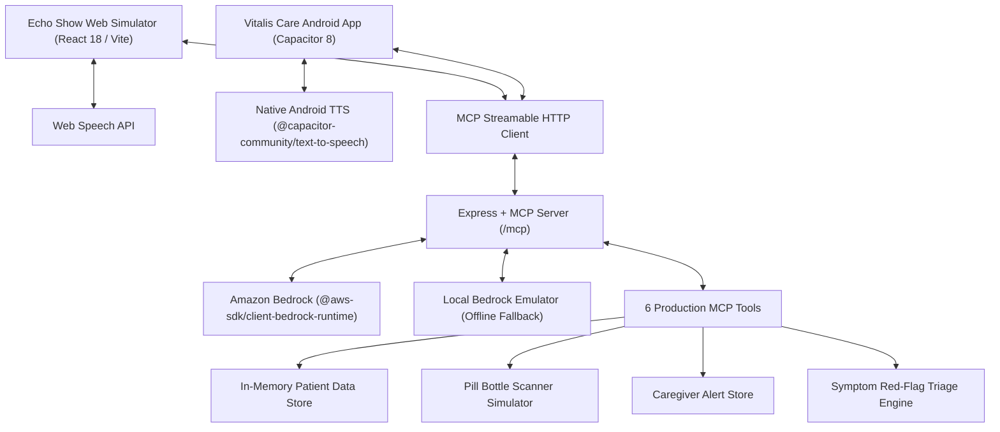

# Technical Architecture & MCP Tool Specifications: Vitalis AI & Vitalis Care

## Architecture Overview

Vitalis AI is built on a decoupled, protocol-driven architecture separating the generative AI response layer, deterministic clinical safety rules, structured tool execution, and client user interfaces.

---

## ⚡ Model Context Protocol (MCP) Implementation

- **Specification**: `2025-11-25`
- **SDK**: `@modelcontextprotocol/sdk` (v1.0.4)
- **Transport**: Streamable HTTP (`POST /mcp`, `GET /mcp`, `DELETE /mcp`)
- **Session Handling**: Stateful sessions identified by the `mcp-session-id` HTTP request header
- **Telemetry Stream**: Server-Sent Events endpoint at `GET /sse` for developer inspection

---

## 🛠️ Registered MCP Tools

| Tool Name | Parameters | Behavior & Return Payload |
| :--- | :--- | :--- |
| `check_medication_schedule` | `patientId` (string), `timeOfDay` (optional enum: `morning`, `afternoon`, `evening`, `bedtime`, `all`) | Filters demo patient scheduled doses by time of day, calculates adherence percentage and streak length. |
| `log_medication_dose` | `patientId` (string), `medicationId` (string), `status` (enum: `taken`, `skipped`, `delayed`) | Updates dose state in `PatientStore`. Logging `taken` increments adherence streak; `skipped`/`delayed` updates state without padding. |
| `verify_pill_bottle_vision` | `patientId` (string), `samplePillPreset` (string: `lisinopril_20mg`, `penicillin_mismatch`, `expired_bottle`) | Evaluates visual pill verification test preset against patient profile, checking drug name, dosage, expiration, and patient allergy red flags. |
| `evaluate_health_symptoms` | `patientId` (string), `reportedSymptoms` (string) | Evaluates symptom description against emergency red flags (e.g., chest pain, difficulty breathing), assigns triage level, dispatches caregiver alert, and invokes Bedrock. |
| `dispatch_caregiver_alert` | `patientId` (string), `urgency` (enum: `INFO`, `WARNING`, `URGENT`, `EMERGENCY`), `eventDescription` (string), `suggestedAction` (optional) | Logs an alert event in the caregiver portal store with urgency metadata and suggested action items. |
| `get_daily_vital_summary` | `patientId` (string) | Returns latest physiological vitals (blood pressure, heart rate, blood glucose, hydration, sleep) with status indicators (`normal`, `warning`, `critical`). |

---

## 📱 Mobile Platform Architecture (**Vitalis Care**)

- **Framework**: Capacitor 8 (`@capacitor/core`, `@capacitor/android`)
- **Android Target**: OpenJDK 21, Gradle `8.5`, Android API 33/36
- **Package ID**: `com.vitalis.app`
- **Application Label**: `Vitalis Care`
- **Native Audio**: `@capacitor-community/text-to-speech` plugin for reliable audio output inside Android WebView
- **Microphone Permissions**: `android.permission.RECORD_AUDIO` and `android.permission.MODIFY_AUDIO_SETTINGS`
- **Layout Engine**: Responsive screen-fit layout with safe-area padding and vertical scroll flex wrappers, tested on physical Tecno Spark 20 (720x1612 display).

---

## 🔒 Implemented vs. Simulated Boundaries

| Component | Implemented & Working | Simulated / Predefined |
| :--- | :--- | :--- |
| **MCP Protocol** | Full Streamable HTTP spec `2025-11-25` via Express & official MCP SDK | None |
| **State Management** | Functional in-memory `PatientStore` with real state mutation | Resets on server restart (no PHI persistence) |
| **Android Application** | Full Capacitor 8 build, native TTS, verified physical APK installation | None |
| **AI LLM Layer** | `@aws-sdk/client-bedrock-runtime` API integration | Local Bedrock emulator fallback when AWS keys are absent |
| **Pill Verification** | Safety verification logic & allergy checking algorithms | Simulated camera OCR (uses predefined test presets) |
| **Caregiver Portal** | Real-time alert store logging and UI modal rendering | External SMS/cellular emergency dispatch |
| **Alexa Skill** | Interactive Echo Show web simulator interface | Published Alexa Skill Store voice skill |
